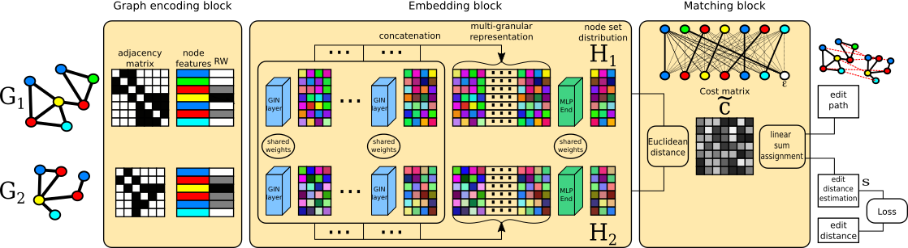

# GNOME
Graph Node Matching for Edit Distance\
Repository of code of the article "Graph Node Matching for Edit Distance", Pattern Recognition Elsevier.
This repo contains a supervised metric learning approach that combines Graph Neural Networks(GNN) and optimal transport to learn an approximation of the Graph Edit Distance (GED) in an end-to-end fashion. The model consists of two siamese GNNs and a comparison block. Each graph pair’s nodes are augmented by positional encoding and embedded by multiple Graph Isomorphism Network(GIN) layers. The obtained embeddings are
then compared through a Multi-Layer Perceptron and Linear Sum Assignement Problem(LSAP) solver applied on a node-wise Euclidean metric defined in the embedding space.



## Table of Contents

- [Installation](#installation)
- [Usage](#usage)
- [Data](#data)
- [License](#license)

## Installation

python version: Python 3.9.7 \
torch version: Pytorch 1.11.0 \
CUDA Version: CUDA 11.6


## Usage
Following is the command line to launch a training on Linux dataset : 

``` python python/main_GNOME.py --basedir /my_directory --dataset Linux_csv/Linux.csv```
## Data
Link for data repository: [data_folder_link](https://drive.google.com/drive/folders/1wiebwTGNJ3oNL1phEoL5TKk8b72gBJ0f?usp=sharing)

## License
This project is licensed under the MIT License - see the [LICENSE.md](../LICENSE) file for details.
